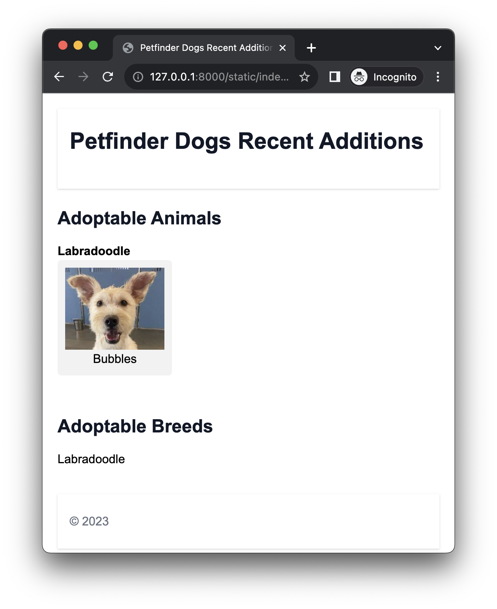

# Petfinder

A web UI for browsing recently added pets from the petfinder api.



Thie repo is a GitHub Copilot assisted project.


## Quickstart

This project requires Petfinder API credentials.  You can get them from https://www.petfinder.com/developers/v2/docs/ and export them in your shell.

```bash
export PF_API_KEY="..."
export PF_API_SECRET="..."
```

You can also save them to a file and source that file.
```bash
> cat .env
export PF_API_KEY="..."
export PF_API_SECRET="..."

> source ./.env
```

Install dependencies, download the data, and start the web UI.

```bash
# create virtual directory
python -m venv venv

# source the virtual environment
source venv/bin/activate

# install dependencies
pip3 install -r requirements.txt

# set the petfinder api key environment variables
source ./.env

# run a search for all breeds
python -m src.petfinder.export search

# run a search for all breeds except English Bulldog
python ./src/petfinder/export.py --exclude "English Bulldog" search

# start the web UI
uvicorn src.petfinder.api:app --reload

# alternatively, start the web UI in debug mode
python -m src.petfinder.api

# load the web interface
open http://127.0.0.1:8000/static/index.html
```

## Overview

Use the petfinder api to download the pets for a query and then present a web UI for fast browsing.
The local website is FastApi to serve the cached endpoints though a local api.

```
├── archive             Breed/pet info is downloaded to
├── data                Current cache of breed/pet info
└── src                 Source code
    ├── petfinder       Python code to download and cache the data
    └── static          Website html and javascript
```